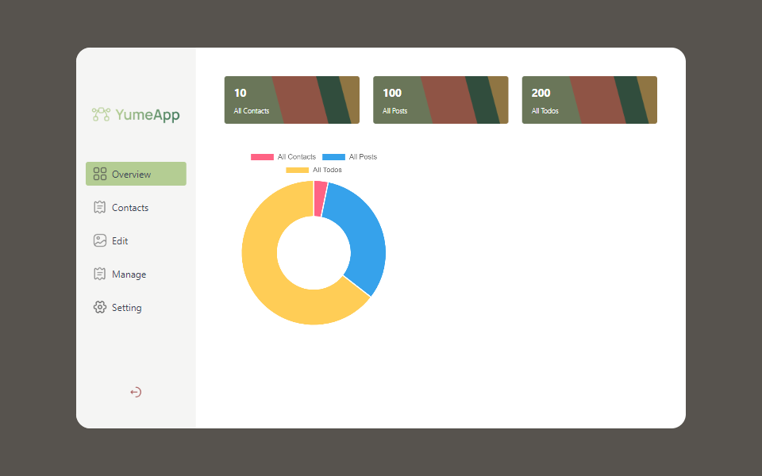
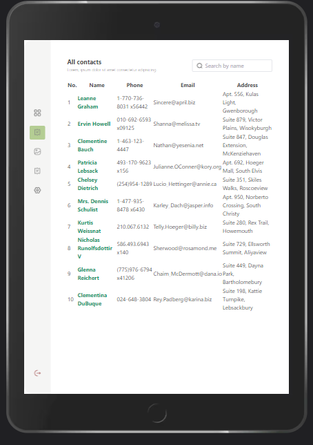

# Contacts App
The application to view contacts list.

## Run the app
- Download through github link or unzip the folder.
- yarn install 
- yarn start 

## Source Code
The source code has kept on the git repository: https://github.com/YumeLoL/react-contacts-app

### Folder Structure
The code are split to the folders:

.    
├── ...                   
├── src     
│   ├── hooks              # Custom hooks
│   ├── images              
│   ├── pages              # Main pages
│   ├── types              # TS type config
|   ├── ui                 # ui components file
│   └── ...                               
| 
└── README.md

### Main features
- Overview page
  data visualization (chartJS): dynamic charts that tracks live data.
- Contacts page
  - showing contacts list (/users)
  - click contacts name to see contacts details
  - search contacts by name
- ContactDetails page
  showing individual information about contact and a map shows address geo.
- Side bar with toggle button
- Responsive to Pad

